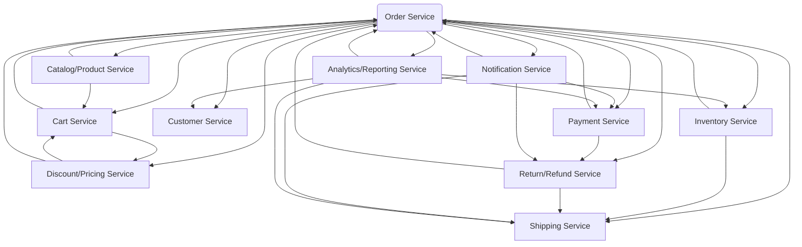

```mermaid
graph TD
    %% Order Service Central Hub
    A(Order Service)

    %% Key Services Connecting to Order Service
    B[Inventory Service]
    C[Payment Service]
    D[Shipping Service]
    E[Customer Service]
    F[Notification Service]
    G[Cart Service]
    H[Discount/Pricing Service]
    I[Return/Refund Service]
    J[Analytics/Reporting Service]
    K[Catalog/Product Service]

    %% Interactions with Order Service
    A --> B
    A --> C
    A --> D
    A --> E
    A --> F
    A --> G
    A --> H
    A --> I
    A --> J
    A --> K

    %% Payment Interaction
    C --> A
    C --> I

    %% Inventory and Shipping
    B --> A
    B --> D

    %% Return/Refund
    I --> A
    I --> D

    %% Notifications
    F --> A
    F --> C
    F --> D
    F --> I

    %% Analytics and Reporting
    J --> A
    J --> B
    J --> C
    J --> D
    J --> E

    %% Cart and Pricing Interaction
    G --> A
    G --> H
    H --> G
    H --> A

    %% Catalog/Product Service
    K --> G
    K --> A
```
