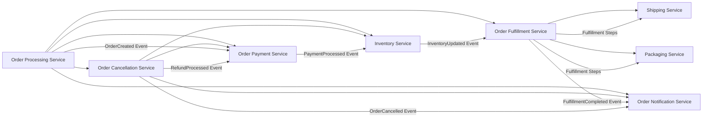

```mermaid
graph LR
A[Order Processing Service] --> B[Order Payment Service]
A --> C[Inventory Service]
A --> D[Order Fulfillment Service]
A --> E[Order Notification Service]
A --> F[Order Cancellation Service]

    D --> G[Shipping Service]
    D --> H[Packaging Service]
    
    F --> B[Order Payment Service]
    F --> C[Inventory Service]
    F --> E[Order Notification Service]

    %% Event-driven communication
    A -- "OrderCreated Event" --> B
    B -- "PaymentProcessed Event" --> C
    C -- "InventoryUpdated Event" --> D
    D -- "FulfillmentCompleted Event" --> E
    F -- "OrderCancelled Event" --> E
    F -- "RefundProcessed Event" --> B
    
    %% Routing Slips (dynamic workflow steps)
    D -- "Fulfillment Steps" --> G
    D -- "Fulfillment Steps" --> H

```